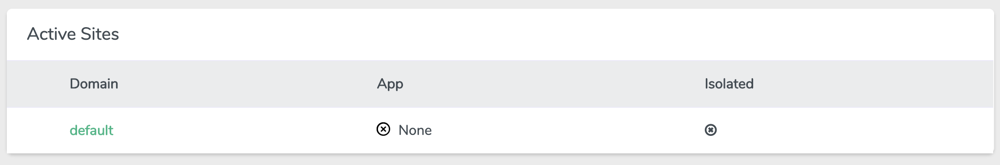

# The Redirector


A simple Laravel redirect application that redirects any request to a certain url.

## Set-Up

Simply set the following values within your .env file.
```text
REDIRECT_URL="https://www.codebar.ch"
```

## Use case
I use this app on my Laravel Forge Servers as the default application


